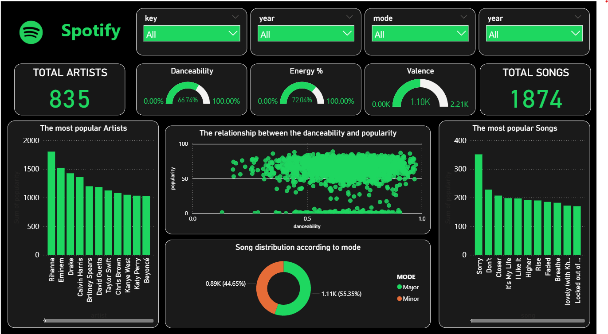

# 🎧 Spotify Music Dashboard — Power BI Project

Welcome to my **Power BI dashboard project** where I analyze Spotify music data to uncover trends and insights related to tracks, artists, genres, and audio features.

---

## 📊 Key Dashboard Features

- 🎵 **Top Artists and Tracks** by popularity  
- 📅 **Release Trends** over years  
- 🎚️ **Audio Features**: energy, danceability, tempo, etc.  
- 🎼 **Genre Distribution**  
- 🔎 **Interactive filters** for dynamic exploration (year, genre, artist)

---

## 🛠 Tools & Skills Used

- **Power BI** (data model, DAX, slicers, cards, custom visuals)  
- Data cleaning & transformation  
- Data storytelling & design

---

## 📁 Files Included

- `spoty.pbix` — the full Power BI dashboard project  
- `images/` — dashboard screenshots (📷 recommended to add a preview)  

---

## 🔗 Preview

> 📷 *Coming soon:* add a screenshot or GIF of the dashboard here

---

## 💬 Feedback & Contributions

If you have any feedback or suggestions, feel free to open an issue or connect with me on [LinkedIn](https://www.linkedin.com/in/ahmed-elmorkake/)!

---

## 📌 Author

**Ahmed Mansour** — Data Enthusiast | Power BI Explorer  
📍 Egypt  

